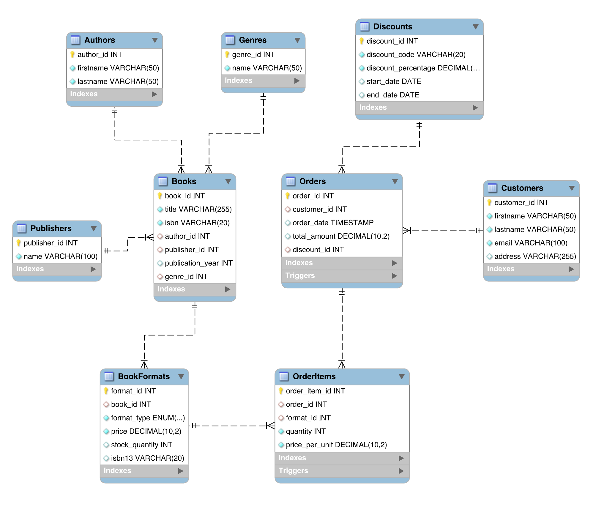

# Online Bookstore

This project demonstrates the design and implementation of a hybrid database system for an online bookstore, leveraging both SQL and NoSQL technologies. The goal is to effectively manage structured, transactional data using SQL and semi-structured, evolving data using NoSQL to meet the diverse needs of a modern e-commerce platform.

## Technologies Used

- **SQL Database**: [MySQL version 8.0](https://hub.docker.com/_/mysql)
- **NoSQL Database**: [MongoDB version 7.0](https://hub.docker.com/_/mongo)

## How to Use

- **Executing SQL Queries**: Use a MySQL client, like [MySQL Workbench](https://www.mysql.com/products/workbench/) or [DBeaver](https://dbeaver.com/), to connect to the database and execute the queries in `./SQL/` folder.
- **Executing NoSQL Queries**: Use the MongoDB shell `mongo` to connect to the database and run the queries from `./NOSQL/` folder using this command `load(/path/to/script.js)`. Optionally, you can use VS Code with [MongoDB](https://marketplace.visualstudio.com/items?itemName=mongodb.mongodb-vscode) extension to connect to the database and run the queries with UI.
